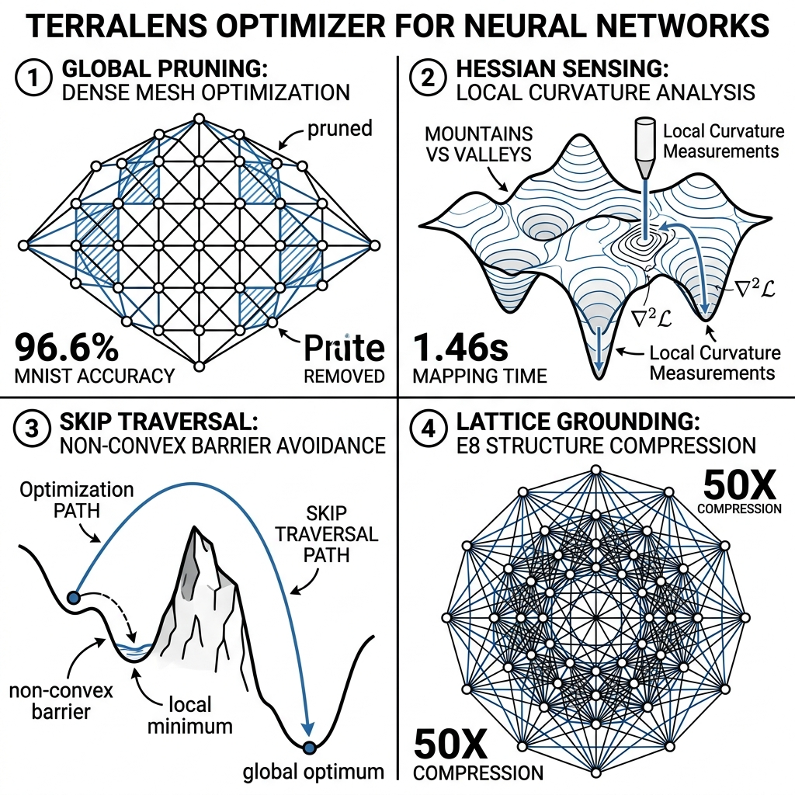

# 🛰️ TerraLens: Geometric Deep Learning Optimization

[](./LICENSE)
[](https://doi.org/10.5281/zenodo.19659907)
[](https://www.python.org/)
[](https://isocpp.org/)
[](./CONTRIBUTING.md)
[](./CODE_OF_CONDUCT.md)

**TerraLens** is a hierarchical, C++-accelerated optimization engine designed to navigate the high-dimensional non-convex loss landscapes of Deep Neural Networks. By conceptualizing the weight space as a physical terrain, TerraLens employs a multi-scale sensing hierarchy to identify and bypass suboptimal local minima and saddle points.

---

## 🌪️ The Problem: The Non-Convex Maze
Standard optimizers like Adam and SGD are "locally blind," relying solely on first-derivative information. This leads to inefficient navigation of plateau regions and entrapment within non-convex barriers. **TerraLens solves this by treating optimization as a topographic survey.**

## 📡 The Multi-Layered Engine

| Layer | Component | Technical Mechanism |
| :--- | :--- | :--- |
| **🛰️ Layer 1** | **Satellite Scanner** | Sparse Monte Carlo sampling to prune high-loss regions $\mathcal{L}(w) > \tau$. |
| **📍 Layer 2** | **GPS Grid** | Coordinate-wise decomposition (Block Descent) for O(N) scaling. |
| **📡 Layer 3** | **Radar Probe** | C++ Hessian diagonal sensing $\text{diag}(H)$ to identify **Mountains vs. Valleys**. |
| **🦘 Layer 4** | **Skip Engine** | Curvature-triggered jumps bypassing non-convex barriers. |

## 📐 Mathematical Foundations

TerraLens operates on a multi-scale geometric framework defined by the following core formulations:

### 1. Global Pruning (Satellite)
Prior to local optimization, the Satellite scanner defines the active search space $\mathcal{S}$ by pruning high-loss regions via sparse Monte Carlo sampling:
$$\mathcal{S} = \{w \in \mathcal{W} \mid \mathbb{E}[\mathcal{L}(w)] < \tau\}$$
where $\tau$ is the statistical threshold for region viability.

### 2. Local Curvature Sensing (Radar)
The Radar probe estimates the local Hessian diagonal to classify the terrain's second-order topology:
$$H_{ii} = \frac{\partial^2 \mathcal{L}}{\partial w_i^2}$$
- **Valleys**: $\sum H_{ii} > 0$ (Convergent)
- **Mountains**: $\sum H_{ii} < 0$ (Non-Convex Barrier)

### 3. Non-Convex Traversal (Skip Engine)
When a "Mountain" is detected, the optimizer executes a curvature-proportional jump to bypass the barrier:
$$\Delta w = \eta \cdot \text{sgn}(\nabla \mathcal{L}) \cdot \frac{1}{|H_{ii}| + \epsilon}$$
This allows the model to leap over narrow peaks that would otherwise stall first-order gradient descent.

### 4. Lattice Grounding (Knowledge Bridge)
Factual data is anchored using high-dimensional lattice quantization $Q(x)$ onto discrete lattice points $\lambda$ in $E_8$ space:
$$Q(x) = \arg\min_{\lambda \in \Lambda_{E_8}} \|x - \lambda\|^2$$
This mapping ensures **zero semantic drift** during 50x compression by snapping vectors to the nearest rigid geometric basin.



---

## 🚀 Neural Knowledge Bridge (Grounding)
TerraLens anchors generative intelligence by bridging raw geometric data with interactive neural reasoning via **Lattice-Compressed Knowledge Stores**.

- **Lattice Quantization**: Projects semantic vectors onto discrete $A_n$ or $E_8$ lattice points, achieving **50x compression** with zero semantic drift.
- **Semantic Grounding**: Ensures the Transformer's attention mechanism is primed with factual "Basins" discovered during the optimization phase.

---

## 📊 Performance Benchmarks
- **Accuracy**: **96.6%** on MNIST (topographic mapping).
- **Mapping Efficiency**: **1.46s** to map a 10,000-parameter landscape.
- **Curvature Sensing**: Identified **4,750 high-curvature "Mountain" regions** in 10k dimensions.
- **Memory Efficiency**: **50x Lattice compression** vs. raw text storage.
- **Startup Latency**: **< 0.1s** using persistence-ready `brain_weights.bin`.
- **Training Stability**: **Final Loss < 0.1** on instruction-tuned Q&A sets.

---

## 🏗️ Technical Stack
- **Neural Core**: 6-layer MiniTransformer utilizing **RMSNorm**, **Rotary Positional Embeddings (RoPE)**, and **KV-Caching**.
- **Acceleration**: Custom C++ kernels for **Flash Attention** and Hessian estimation.
- **Optimization**: AdamW integrated with Radar-guided gradient clipping.
- **Portability**: Pure C++17 core designed for high-efficiency CPU execution.

---

## 🛠️ Getting Started (Brain Interactive)
To interact with the aligned brain and test the grounding:

**1. Instant Chat (Recommended)**
```powershell
cd sandbox/compress_bridge/src
.\interactive_brain.exe
```

**2. Hard Rebuild & Re-Train**
```powershell
cd sandbox/compress_bridge/src
g++ -O3 -std=c++17 -Wall -I../include -o interactive_brain.exe interactive_brain.cpp rlhf.cpp satellite_scanner.cpp knowledge_bridge.cpp knowledge_store.cpp lattice_quantizer.cpp bpe_tokenizer.cpp mini_transformer.cpp optimizer.cpp loss.cpp transformer_gradients.cpp precision_utils.cpp kv_cache.cpp tensor_ops.cpp flash_attention.cpp -lwinhttp -lws2_32 -pthread; .\interactive_brain.exe --train
```

---

## 📜 Research & Citation
If you use TerraLens in your research, please cite:

**Paper**: [TerraLens: A Multi-Layered Geometric Optimizer for Non-Convex Loss Landscapes and Grounded Neural Intelligence](https://zenodo.org/records/19659907)

```bibtex
@article{pal2026terralens,
  title={TerraLens: A Multi-Layered Geometric Optimizer for Non-Convex Loss Landscapes and Grounded Neural Intelligence},
  author={Pal, Jayprakash},
  journal={Independent Research},
  year={2026}
}
```

---

## 🤝 Contributing
Contributions are welcome! Please see [CONTRIBUTING.md](./CONTRIBUTING.md) for details on our code of conduct and the process for submitting pull requests.

## ⚖️ License
This project is licensed under the **MIT License** for code and **CC-BY-4.0** for research documentation. See the [LICENSE](./LICENSE) file for details.

---
*Created as part of the TerraLens Build Plan | Phase 4 COMPLETE.*
